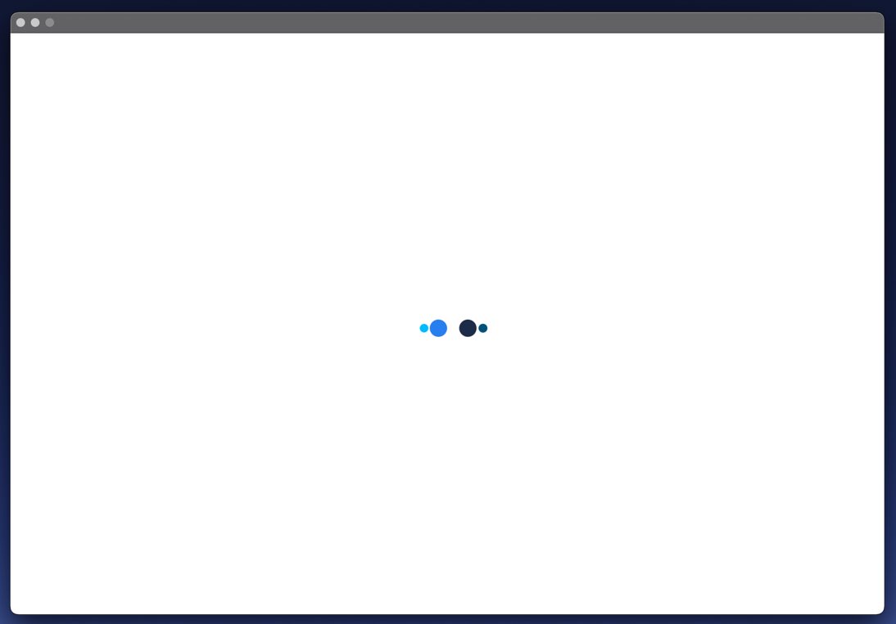
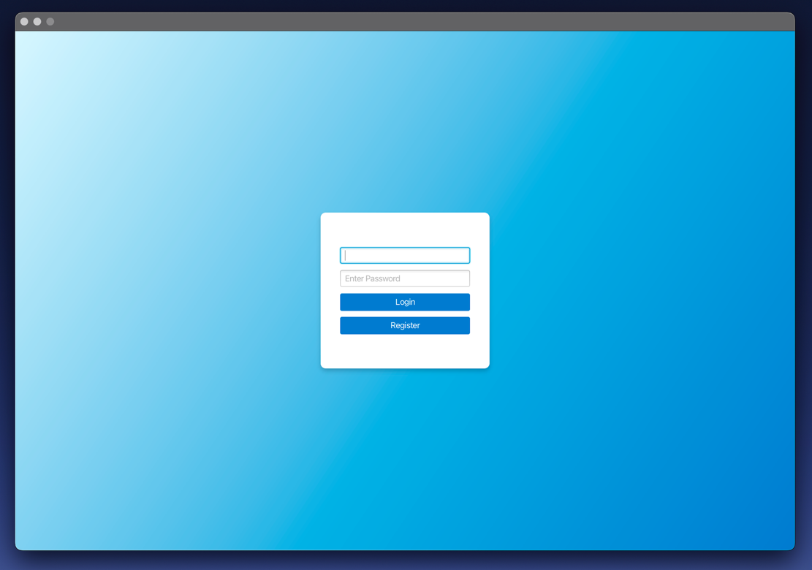
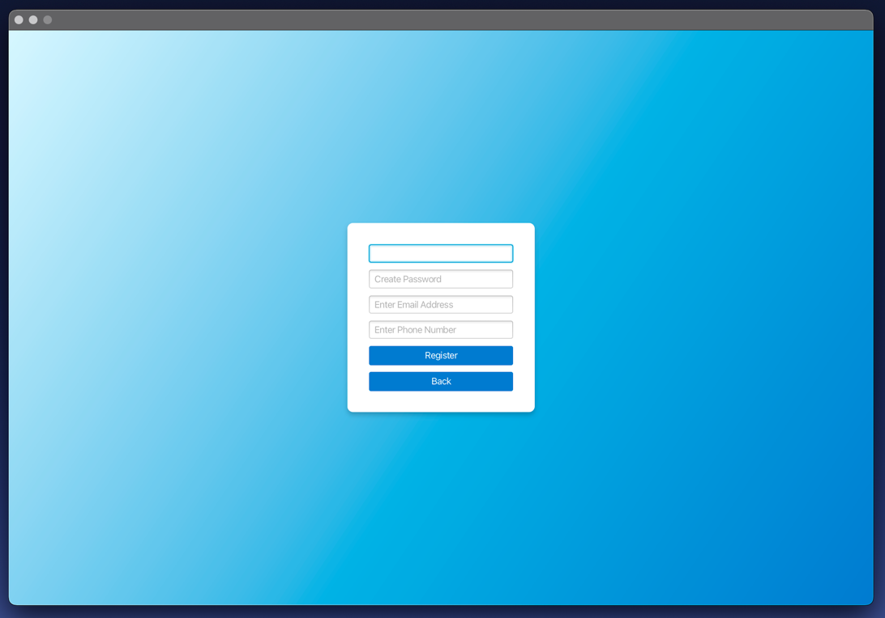
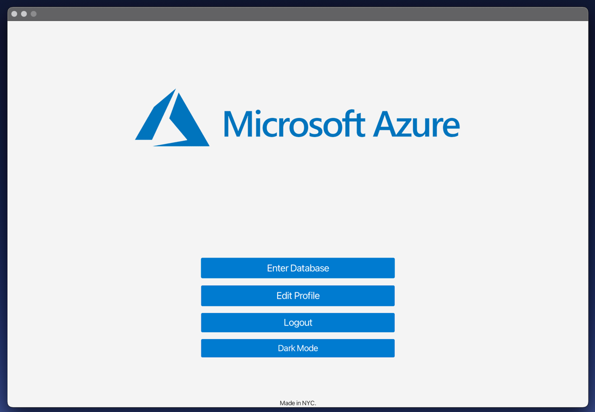
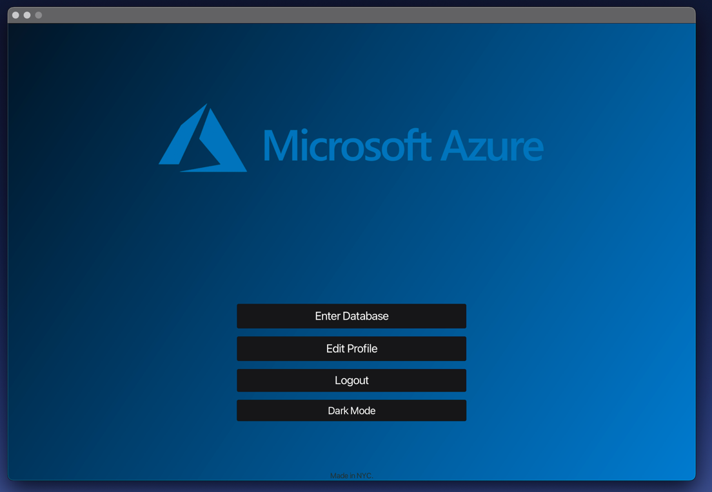
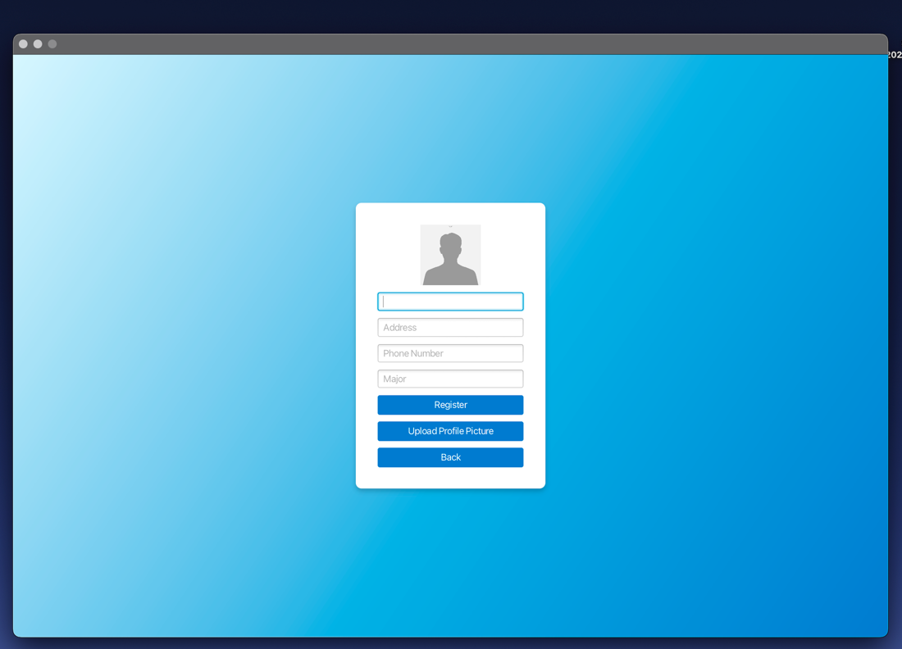
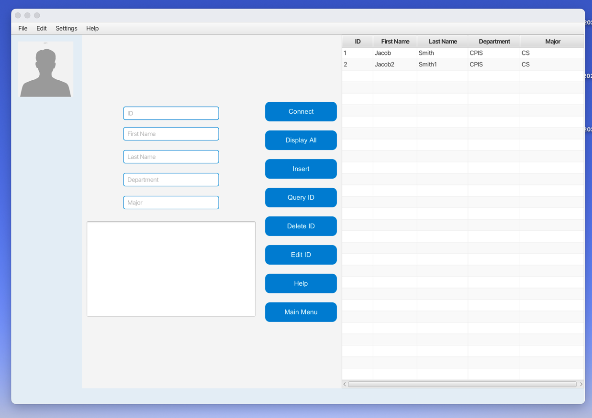

  Add Gif

  This full stack JavaFX project integrates a user-friendly dark/light-themed UI with Azure SQL Database with full CRUD operations.

## 📚 Table of Contents
- [💬 Introduction](#-introduction)
- [🚀 Features](#-features)
- [🧰 Tech Stack](#-tech-stack-and-libraries)
- [📝 License](#-license)

## 💬 Introduction
This project 

## 🚀 Features
- Connects to a Remote Azure MySQL Flexible Server
- Displays all Students in a JavaFX TableView
- Insert students into the table with 
  - ID Number
  - First Name
  - Last Name
  - Department
  - Major
- Connect to the Database
- Query students by their ID
- Edit existing students
- Delete students from the table
- Display the entire table
- Keyboard Shortcuts
- File Upload
- User interface
  - Splash Screen
  - Login Page
  - Registration Page
  - Menu Page (Dark Mode)
  - Profile Page
  - Database Manager
  - Help Page
  
## 🧰 Tech Stack and Libraries

## 📝 License
This project uses the MIT License. 